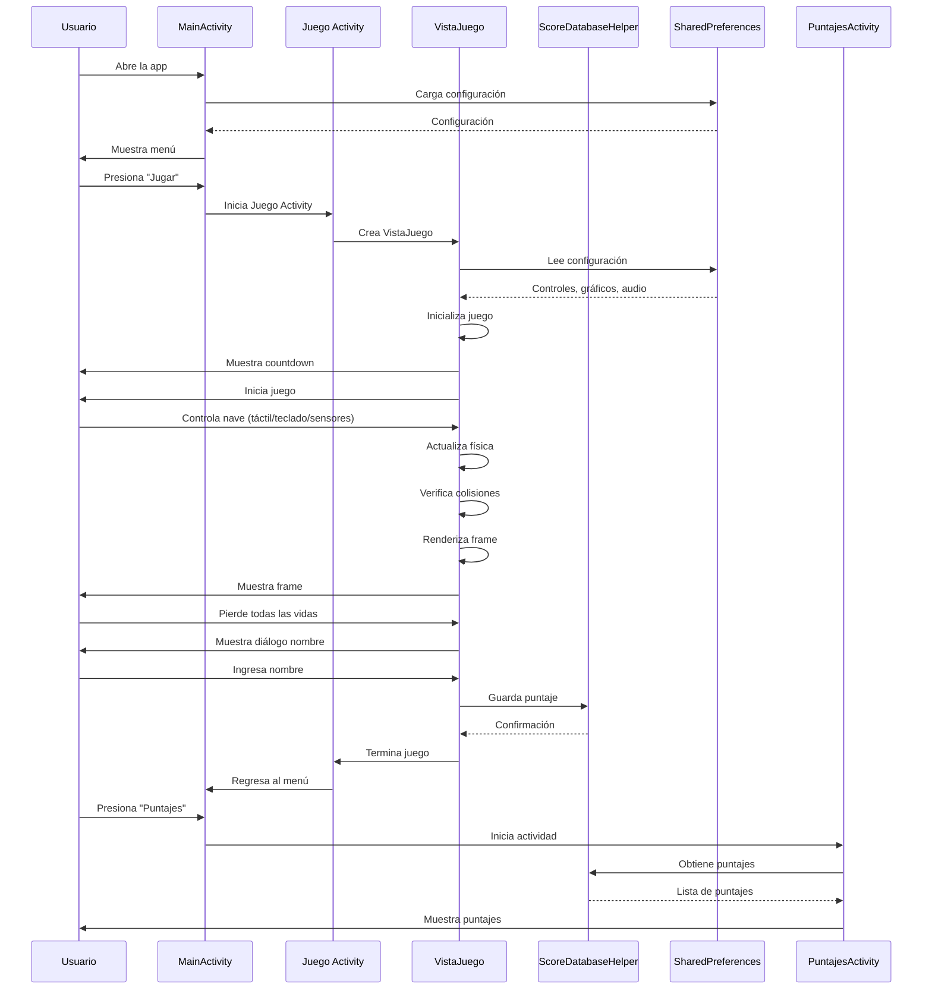
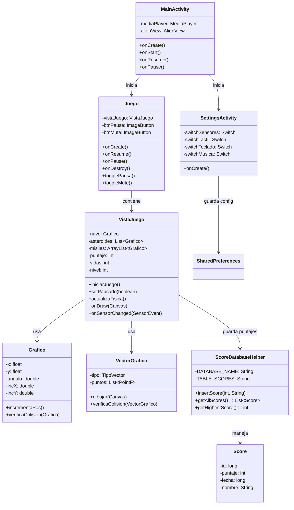
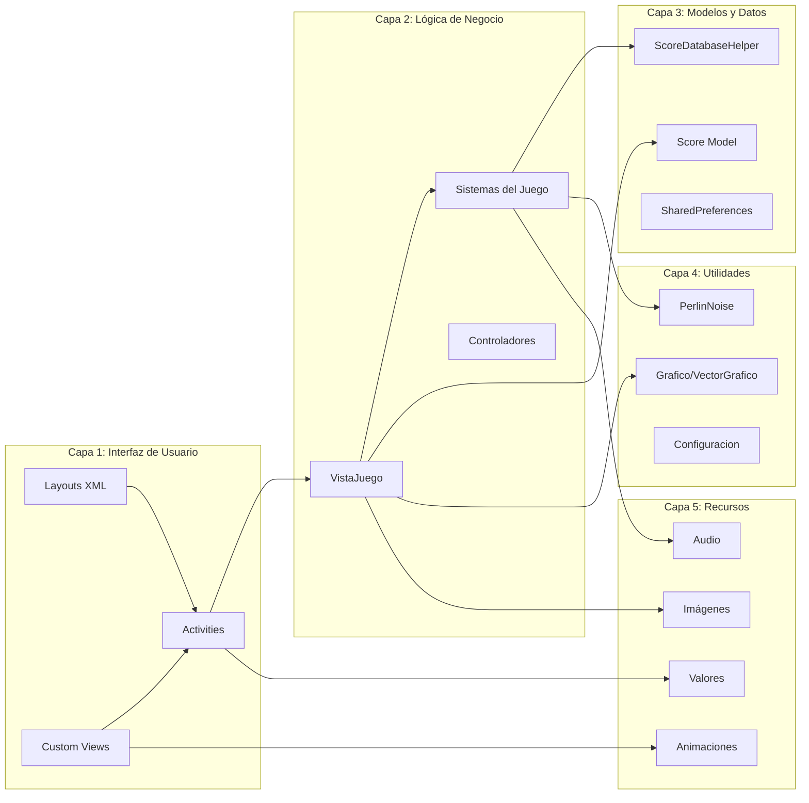

# Diagrama de Arquitectura - AsteroidesApp

## Arquitectura del Sistema

```mermaid
graph TB
    subgraph "Capa de Presentación (UI)"
        MainActivity[MainActivity<br/>Menú Principal]
        JuegoActivity[Juego<br/>Actividad del Juego]
        SettingsActivity[SettingsActivity<br/>Configuración]
        PuntajesActivity[PuntajesActivity<br/>Puntajes]
        AcercaDeActivity[AcercaDeActivity<br/>Acerca de]
    end

    subgraph "Capa de Vista (Custom Views)"
        VistaJuego[VistaJuego<br/>Lógica Principal del Juego]
        CountdownView[CountdownView<br/>Cuenta Regresiva]
        StarView[StarView/StarViewGame<br/>Fondo de Estrellas]
        GalaxyView[GalaxyView<br/>Fondo de Galaxia]
        NebulaView[NebulaView<br/>Fondo de Nebulosa]
        AlienView[AlienView<br/>Aliens Animados]
    end

    subgraph "Capa de Componentes Gráficos"
        Grafico[Grafico<br/>Gráficos Normales]
        VectorGrafico[VectorGrafico<br/>Gráficos Vectoriales]
    end

    subgraph "Capa de Componentes UI"
        RainbowButton[RainbowButton<br/>Botón Arcoíris]
        PixelArtButton[PixelArtButton<br/>Botón Pixel Art]
        AnimatedGalaxyButton[AnimatedGalaxyButton<br/>Botón Galaxia]
    end

    subgraph "Capa de Datos"
        ScoreDatabaseHelper[ScoreDatabaseHelper<br/>SQLite Helper]
        Score[Score<br/>Modelo de Datos]
        ScoreAdapter[ScoreAdapter<br/>Adapter Lista]
        SharedPreferences[SharedPreferences<br/>Configuración]
    end

    subgraph "Capa de Utilidades"
        PerlinNoise[PerlinNoise<br/>Generador Ruido]
        Configuracion[Configuracion<br/>Config Helper]
    end

    subgraph "Sistemas del Juego"
        SistemaFisica[Sistema de Física<br/>Movimiento, Colisiones]
        SistemaAudio[Sistema de Audio<br/>MediaPlayer, SoundPool]
        SistemaSensores[Sistema de Sensores<br/>Acelerómetro, Giroscopio]
        SistemaPowerUps[Sistema Power-ups<br/>Escudos, Mejoras]
        SistemaNiveles[Sistema de Niveles<br/>Progresión, Bonus]
    end

    subgraph "Recursos"
        Layouts[Layouts XML<br/>activity_*.xml, juego.xml]
        Drawables[Drawables<br/>Imágenes PNG, XML]
        Animations[Animaciones<br/>button_*.xml]
        Audio[Audio<br/>MP3 Files]
        Values[Values<br/>strings.xml, colors.xml]
    end

    MainActivity --> JuegoActivity
    MainActivity --> SettingsActivity
    MainActivity --> PuntajesActivity
    MainActivity --> AcercaDeActivity

    JuegoActivity --> VistaJuego
    JuegoActivity --> CountdownView
    JuegoActivity --> StarView

    VistaJuego --> SistemaFisica
    VistaJuego --> SistemaAudio
    VistaJuego --> SistemaSensores
    VistaJuego --> SistemaPowerUps
    VistaJuego --> SistemaNiveles
    VistaJuego --> Grafico
    VistaJuego --> VectorGrafico

    SistemaFisica --> Grafico
    SistemaFisica --> VectorGrafico

    PuntajesActivity --> ScoreDatabaseHelper
    ScoreDatabaseHelper --> Score
    PuntajesActivity --> ScoreAdapter
    ScoreAdapter --> Score

    SettingsActivity --> SharedPreferences
    VistaJuego --> SharedPreferences

    VistaJuego --> PerlinNoise
    StarView --> PerlinNoise
    GalaxyView --> PerlinNoise
    NebulaView --> PerlinNoise

    MainActivity --> Layouts
    JuegoActivity --> Layouts
    SettingsActivity --> Layouts
    PuntajesActivity --> Layouts

    VistaJuego --> Drawables
    VistaJuego --> Animations
    VistaJuego --> Audio

    MainActivity --> Audio
    SettingsActivity --> Values
```

## Flujo de Datos

```mermaid
sequenceDiagram
    participant U as Usuario
    participant MA as MainActivity
    participant JA as Juego Activity
    participant VJ as VistaJuego
    participant DB as ScoreDatabaseHelper
    participant SP as SharedPreferences

    U->>MA: Abre la app
    MA->>SP: Carga configuración
    SP-->>MA: Configuración
    MA->>U: Muestra menú

    U->>MA: Presiona "Jugar"
    MA->>JA: Inicia Juego Activity
    JA->>VJ: Crea VistaJuego
    VJ->>SP: Lee configuración
    SP-->>VJ: Controles, gráficos, audio
    VJ->>VJ: Inicializa juego
    VJ->>U: Muestra countdown
    VJ->>U: Inicia juego

    U->>VJ: Controla nave (táctil/teclado/sensores)
    VJ->>VJ: Actualiza física
    VJ->>VJ: Verifica colisiones
    VJ->>VJ: Renderiza frame
    VJ->>U: Muestra frame

    U->>VJ: Pierde todas las vidas
    VJ->>U: Muestra diálogo nombre
    U->>VJ: Ingresa nombre
    VJ->>DB: Guarda puntaje
    DB-->>VJ: Confirmación
    VJ->>JA: Termina juego
    JA->>MA: Regresa al menú

    U->>MA: Presiona "Puntajes"
    MA->>PuntajesActivity: Inicia actividad
    PuntajesActivity->>DB: Obtiene puntajes
    DB-->>PuntajesActivity: Lista de puntajes
    PuntajesActivity->>U: Muestra puntajes
```

## Arquitectura de Componentes

```mermaid
classDiagram
    class MainActivity {
        +onCreate()
        +onStart()
        +onResume()
        +onPause()
        -mediaPlayer: MediaPlayer
        -alienView: AlienView
    }

    class Juego {
        +onCreate()
        +onResume()
        +onPause()
        +onDestroy()
        -vistaJuego: VistaJuego
        -btnPause: ImageButton
        -btnMute: ImageButton
        +togglePausa()
        +toggleMute()
    }

    class VistaJuego {
        -nave: Grafico
        -asteroides: List~Grafico~
        -misiles: ArrayList~Grafico~
        -puntaje: int
        -vidas: int
        -nivel: int
        +iniciarJuego()
        +setPausado(boolean)
        +actualizaFisica()
        +onDraw(Canvas)
        +onSensorChanged(SensorEvent)
    }

    class Grafico {
        -x: float
        -y: float
        -angulo: double
        -incX: double
        -incY: double
        +incrementaPos()
        +verificaColision(Grafico)
    }

    class VectorGrafico {
        -tipo: TipoVector
        -puntos: List~PointF~
        +dibujar(Canvas)
        +verificaColision(VectorGrafico)
    }

    class ScoreDatabaseHelper {
        -DATABASE_NAME: String
        -TABLE_SCORES: String
        +insertScore(int, String)
        +getAllScores(): List~Score~
        +getHighestScore(): int
    }

    class Score {
        -id: long
        -puntaje: int
        -fecha: long
        -nombre: String
    }

    class SettingsActivity {
        +onCreate()
        -switchSensores: Switch
        -switchTactil: Switch
        -switchTeclado: Switch
        -switchMusica: Switch
    }

    MainActivity --> Juego : inicia
    Juego --> VistaJuego : contiene
    VistaJuego --> Grafico : usa
    VistaJuego --> VectorGrafico : usa
    VistaJuego --> ScoreDatabaseHelper : guarda puntajes
    ScoreDatabaseHelper --> Score : maneja
    MainActivity --> SettingsActivity : inicia
    SettingsActivity --> SharedPreferences : guarda config
```

## Sistema de Capas

```mermaid
graph LR
    subgraph "Capa 1: Interfaz de Usuario"
        A1[Activities]
        A2[Layouts XML]
        A3[Custom Views]
    end

    subgraph "Capa 2: Lógica de Negocio"
        B1[VistaJuego]
        B2[Sistemas del Juego]
        B3[Controladores]
    end

    subgraph "Capa 3: Modelos y Datos"
        C1[Score Model]
        C2[ScoreDatabaseHelper]
        C3[SharedPreferences]
    end

    subgraph "Capa 4: Utilidades"
        D1[Grafico/VectorGrafico]
        D2[PerlinNoise]
        D3[Configuracion]
    end

    subgraph "Capa 5: Recursos"
        E1[Imágenes]
        E2[Audio]
        E3[Animaciones]
        E4[Valores]
    end

    A1 --> B1
    A2 --> A1
    A3 --> A1
    B1 --> B2
    B1 --> C1
    B2 --> C2
    B1 --> D1
    B2 --> D2
    B1 --> E1
    B2 --> E2
    A3 --> E3
    A1 --> E4
```

