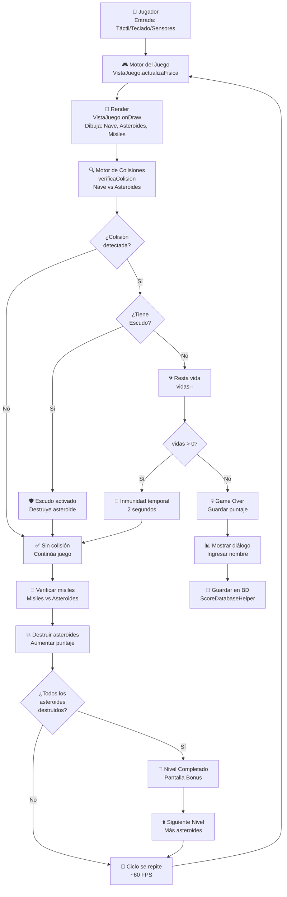
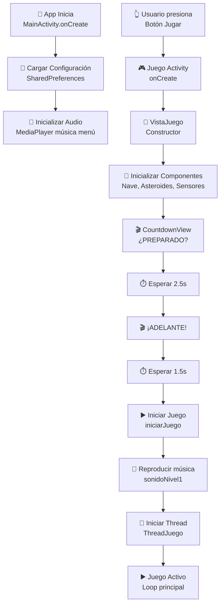
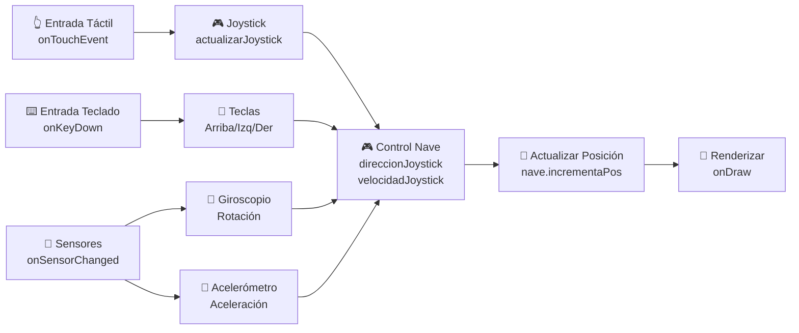
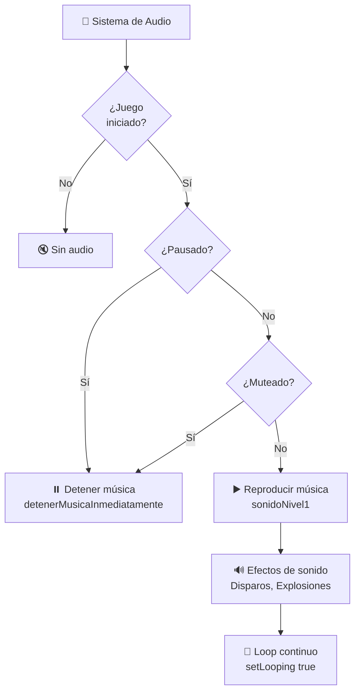
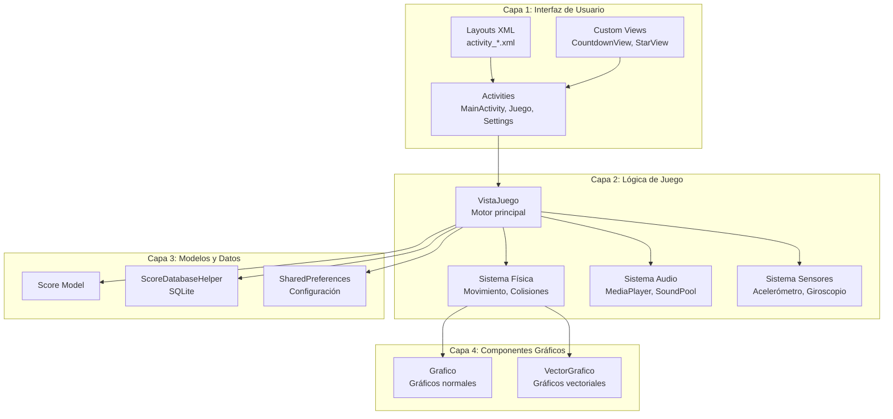

# Diagrama de Flujo y Arquitectura - AsteroidesApp

## Flujo Principal del Juego

```mermaid
flowchart TD
    A[👤 Jugador<br/>Entrada: Táctil/Teclado/Sensores] --> B[🎮 Motor del Juego<br/>VistaJuego.actualizaFisica]
    B --> C[🎨 Render<br/>VistaJuego.onDraw<br/>Dibuja: Nave, Asteroides, Misiles]
    C --> D[🔍 Motor de Colisiones<br/>verificaColision<br/>Nave vs Asteroides]
    D --> E{¿Colisión<br/>detectada?}
    E -->|Sí| F{¿Tiene<br/>Escudo?}
    E -->|No| G[✅ Sin colisión<br/>Continúa juego]
    F -->|Sí| H[🛡️ Escudo activado<br/>Destruye asteroide]
    F -->|No| I[💔 Resta vida<br/>vidas--]
    I --> J{vidas > 0?}
    J -->|Sí| K[🔄 Inmunidad temporal<br/>2 segundos]
    J -->|No| L[💀 Game Over<br/>Guardar puntaje]
    H --> G
    K --> G
    G --> M[🎯 Verificar misiles<br/>Misiles vs Asteroides]
    M --> N[💥 Destruir asteroides<br/>Aumentar puntaje]
    N --> O{¿Todos los<br/>asteroides<br/>destruidos?}
    O -->|Sí| P[🎉 Nivel Completado<br/>Pantalla Bonus]
    O -->|No| Q[🔄 Ciclo se repite<br/>~60 FPS]
    P --> R[⬆️ Siguiente Nivel<br/>Más asteroides]
    R --> Q
    Q --> B
    L --> S[📊 Mostrar diálogo<br/>Ingresar nombre]
    S --> T[💾 Guardar en BD<br/>ScoreDatabaseHelper]
```

## Flujo de Inicialización

```mermaid
flowchart TD
    A[🚀 App Inicia<br/>MainActivity.onCreate] --> B[📱 Cargar Configuración<br/>SharedPreferences]
    B --> C[🎵 Inicializar Audio<br/>MediaPlayer música menú]
    D[👆 Usuario presiona<br/>Botón Jugar] --> E[🎮 Juego Activity<br/>onCreate]
    E --> F[🎯 VistaJuego<br/>Constructor]
    F --> G[🔧 Inicializar Componentes<br/>Nave, Asteroides, Sensores]
    G --> H[🎬 CountdownView<br/>¿PREPARADO?]
    H --> I[⏱️ Esperar 2.5s]
    I --> J[🎬 ¡ADELANTE!]
    J --> K[⏱️ Esperar 1.5s]
    K --> L[▶️ Iniciar Juego<br/>iniciarJuego]
    L --> M[🎵 Reproducir música<br/>sonidoNivel1]
    M --> N[🔄 Iniciar Thread<br/>ThreadJuego]
    N --> O[▶️ Juego Activo<br/>Loop principal]
```

## Flujo de Controles

```mermaid
flowchart LR
    A[👆 Entrada Táctil<br/>onTouchEvent] --> B[🎮 Joystick<br/>actualizarJoystick]
    C[⌨️ Entrada Teclado<br/>onKeyDown] --> D[🎯 Teclas<br/>Arriba/Izq/Der]
    E[📱 Sensores<br/>onSensorChanged] --> F[🔄 Giroscopio<br/>Rotación]
    E --> G[📐 Acelerómetro<br/>Aceleración]
    B --> H[🎮 Control Nave<br/>direccionJoystick<br/>velocidadJoystick]
    D --> H
    F --> H
    G --> H
    H --> I[🚀 Actualizar Posición<br/>nave.incrementaPos]
    I --> J[🎨 Renderizar<br/>onDraw]
```

## Flujo de Sistema de Audio

```mermaid
flowchart TD
    A[🎵 Sistema de Audio] --> B{¿Juego<br/>iniciado?}
    B -->|No| C[🔇 Sin audio]
    B -->|Sí| D{¿Pausado?}
    D -->|Sí| E[⏸️ Detener música<br/>detenerMusicaInmediatamente]
    D -->|No| F{¿Muteado?}
    F -->|Sí| E
    F -->|No| G[▶️ Reproducir música<br/>sonidoNivel1]
    G --> H[🔊 Efectos de sonido<br/>Disparos, Explosiones]
    H --> I[🔄 Loop continuo<br/>setLooping true]
```

## Arquitectura de Capas

```mermaid
graph TB
    subgraph "Capa 1: Interfaz de Usuario"
        A1[Activities<br/>MainActivity, Juego, Settings]
        A2[Layouts XML<br/>activity_*.xml]
        A3[Custom Views<br/>CountdownView, StarView]
    end

    subgraph "Capa 2: Lógica de Juego"
        B1[VistaJuego<br/>Motor principal]
        B2[Sistema Física<br/>Movimiento, Colisiones]
        B3[Sistema Audio<br/>MediaPlayer, SoundPool]
        B4[Sistema Sensores<br/>Acelerómetro, Giroscopio]
    end

    subgraph "Capa 3: Modelos y Datos"
        C1[Score Model]
        C2[ScoreDatabaseHelper<br/>SQLite]
        C3[SharedPreferences<br/>Configuración]
    end

    subgraph "Capa 4: Componentes Gráficos"
        D1[Grafico<br/>Gráficos normales]
        D2[VectorGrafico<br/>Gráficos vectoriales]
    end

    A1 --> B1
    A2 --> A1
    A3 --> A1
    B1 --> B2
    B1 --> B3
    B1 --> B4
    B1 --> C1
    B2 --> D1
    B2 --> D2
    B1 --> C2
    B1 --> C3
```

